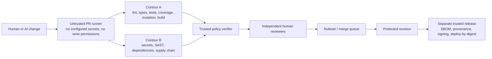

# MergeGrounds

MergeGrounds is a Codex skill and a GitHub-ready starter repository for teams that treat AI-assisted code as untrusted until independent engineering evidence admits the exact revision.

Project website: [mergegrounds.chawax.chatgpt.site](https://mergegrounds.chawax.chatgpt.site) · Source: [github.com/ExCoder/mergegrounds](https://github.com/ExCoder/mergegrounds)

It does not promise “safe code.” No linter, model, scanner, or test suite can prove that. The portable runner fails closed on missing tools, weak metrics, replayable reports, persistent source drift, malformed exception records, and inconclusive results. The stronger admission claim additionally requires the external trusted verifier, protected settings, identities, and isolated execution described below.

## What is included

- a reusable Codex skill for bootstrap, audit, hardening, and gate repair;
- a dependency-free Python 3.11+ policy runner and evidence generator;
- native adapters for Node/TypeScript, Python, Go, Rust, Maven, Gradle, .NET, PHP, and a strict custom protocol;
- parsed coverage and mutation reports with independent threshold enforcement;
- clean-revision local pre-push gates (pre-commit is deliberately not claimed as exact-revision evidence);
- immutable-SHA GitHub Actions for PR checks, read-only supplemental CodeQL, dependency review, secret scanning, schedule-only OpenSSF Scorecard publication, and scheduled full validation;
- CODEOWNERS, subject-bound AI evidence and external-attestation contracts, and a dry-run-first GitHub ruleset installer;
- R0–R4 risk classification, two-contour architecture, threat model, evidence contract, weighted exception budget, and incident-only break-glass policy;
- a design-first AI-assisted development process with acceptance oracles, independent challenge, human explain-back, and outcome/rework measurement;
- integrity sealing for control-plane drift and negative control tests for the MergeGrounds implementation.

## Trust architecture



The files in this repository implement the portable starter layer. The strongest version places the policy verifier and required workflow in a separate organization-owned repository so a candidate cannot modify the judge used for its own admission. See [trusted-control-plane.md](skills/mergegrounds/references/trusted-control-plane.md).

## Two AI assurance scopes

MergeGrounds distinguishes two cases:

- **AI-assisted development:** a model or coding agent helps create software. Its output remains an untrusted proposal and follows the design, admission, challenge, explain-back, and measurement process in [AI-assisted development assurance](docs/ai-assisted-development.md).
- **AI-enabled product:** a model, retrieval pipeline, or agent is part of shipped behavior. Apply all repository controls plus [AI product assurance](skills/mergegrounds/references/ai-product-assurance.md) for stochastic evaluation, retrieval/context, tool authorization, model/provider change, data, cost, and runtime controls.

Using an assistant does not automatically make the product an AI system. Shipping an AI system is not adequately tested merely because its deterministic orchestration code passes CI.

## AI-assisted delivery loop

1. Define the outcome, accountable acceptance oracle, business/security invariants, negative behavior, and non-goals.
2. For R2–R4 or any material boundary/business/data/dependency/operational change, review design before substantive implementation or generation.
3. Implement with least context and least privilege; never let the implementation silently become its own specification.
4. Verify observable results against independent oracles on the exact revision. Model reasoning, confidence, self-critique, or fluent explanation is not evidence, and private chain-of-thought should not be requested or retained.
5. Give a clean-context adversarial reviewer the oracle, design, diff, source, and evidence while initially withholding the author's preferred conclusion. A second model/agent is defense in depth, not a human approval.
6. Require an accountable human to explain behavior, invariants, failure modes, test discrimination, and recovery from the source and design.
7. Measure design-to-production lead time, review/rework/debug load, escapes, change failure rate, recovery, complexity, duplication, comprehension, knowledge spread, and total cost—not generated lines or perceived coding speed.

The portable repository makes these requirements explicit and can structurally validate its change/design records, including whether a required design record already existed on the pull request's base. It cannot prove that prose is true, that human design review preceded work outside Git, that a challenger was genuinely independent, or that a human understands the result. Maximum assurance represents those facts as authenticated, digest-bound attestations in the external verifier. Until then, report them as configured but not externally verified.

## Start a new empty project

`--allow-non-git` is restricted to an existing, completely empty directory. Preview and apply the starter before initializing that exact directory as the Git root:

```bash
mkdir /absolute/path/to/new-empty-project
python3 -I scripts/bootstrap.py \
  --target /absolute/path/to/new-empty-project \
  --allow-non-git
python3 -I scripts/bootstrap.py \
  --target /absolute/path/to/new-empty-project \
  --allow-non-git \
  --apply
git -C /absolute/path/to/new-empty-project init --initial-branch=main
```

Review and tailor every copied control, replace the deliberate activation placeholders, and create the first human-reviewed bootstrap commit while MergeGrounds is still explicitly inactive. The public source repository uses a real owner and a source-only self-dogfood adapter; the bootstrapper deliberately substitutes `templates/bootstrap/CODEOWNERS` and excludes that adapter marker, so a copied repository cannot inherit the upstream maintainer or accidentally start green. Only after the target's clean bootstrap commit should you regenerate the control-plane seal and commit the lock separately as described below. Never use `--allow-non-git` to populate a non-empty directory or to bypass discovery of an enclosing worktree; the bootstrapper rejects both cases.

## Start an existing repository

Preview first; the bootstrapper never overwrites by default:

```bash
python3 -I scripts/bootstrap.py --target /absolute/path/to/repository
```

After reviewing every create/conflict entry:

```bash
python3 -I scripts/bootstrap.py --target /absolute/path/to/repository --apply
```

`--force` is deliberately exceptional. It backs up conflicting files under `.mergegrounds/backups/` and must be used only after manual comparison.

Bootstrap preserves this starter's Apache-2.0 terms at
`.mergegrounds/LICENSE.mergegrounds` and its assurance boundary at
`.mergegrounds/README.mergegrounds.md`; it never replaces the target project's
own top-level `LICENSE`.

Then complete the repository-specific binding:

1. Replace every `@org/security-team` example in `.github/CODEOWNERS` with real, valid owners.
2. Review the detected adapter commands. Retain stronger existing tools instead of introducing duplicates.
3. Pin the runtime, package manager, test tools, scanners, mutation engine, build plugins, and dependency resolution.
4. Merge the supplied generated-output entries into any project-specific `.gitignore`; the runner rejects unexpected untracked files.
5. Configure the adapter's machine-readable coverage/mutation reports, a real fuzz harness for the `full` profile, and a protected project-specific scope verifier that binds a canonical production/changed-path manifest to report-native file and mutant identities. The bundled aggregate parsers alone are diagnostic, not proof that the tool examined every required source path.
6. If the shipped product itself uses inference, retrieval, long context, fine-tuning, or model-driven tools, replace `product_ai = false` with a completed project policy and connect a trusted evaluator that will write the configured report. Generate a schema example while tailoring; placeholders never pass:

   ```bash
   python3 -I scripts/ai_assurance.py print-example --capability inference --capability retrieval
   ```

7. Commit the intended baseline through the pre-existing trusted bootstrap path, seal the reviewed controls, inspect the schema-v2 content/mode entries, and commit the lock as a separate reviewed change:

   ```bash
   python3 -I scripts/mergegrounds.py seal --write
   ```

8. On the final clean `HEAD`, generate any configured AI-product report through the trusted evaluator, then verify policy, AI evidence, repository policy, the iterative PR profile, and the full R3 admission profile:

   ```bash
   python3 -I scripts/ai_assurance.py validate-policy
   python3 -I scripts/ai_assurance.py evaluate
   python3 -I scripts/mergegrounds.py doctor
   python3 -I scripts/mergegrounds.py verify-repo --strict
   python3 -I scripts/mergegrounds.py run --profile pr --evidence .mergegrounds/evidence/pr.json
   python3 -I scripts/mergegrounds.py run --profile full --evidence .mergegrounds/evidence/full.json
   ```

   `evaluate` validates typed, exact-subject evidence; it does not create product cases or turn a candidate-authored report into independent evidence.
9. Prove the gates with safe negative fixtures: mutable action, local candidate action, import-shadow module, replayed report, survived/unviable mutant, missing tool, malformed metric, incomplete case set, expired exception record, and control-plane drift must all fail.
10. Provision an independently administered GitHub App that emits `MergeGrounds / Admission` and `MergeGrounds / Independent Challenge`. Its protected executor must independently rerun applicable project SAST against the exact read-only/content-addressed source snapshot, isolate report outputs from candidate processes, derive the expected changed-file/language scope from trusted Git objects, and sign the reconciled result; candidate-produced CodeQL SARIF remains diagnostic only. Record the App's numeric integration ID, slug, and owner; preview GitHub governance; then apply only with authorized credentials:

   ```bash
   scripts/apply-github-ruleset.sh --repo OWNER/REPOSITORY \
     --verifier-app-id 123456 \
     --verifier-app-slug mergegrounds-verifier \
     --verifier-app-owner OWNER
   scripts/apply-github-ruleset.sh --repo OWNER/REPOSITORY \
     --verifier-app-id 123456 \
     --verifier-app-slug mergegrounds-verifier \
     --verifier-app-owner OWNER \
     --apply
   ```

Repository files cannot prove that the ruleset, secret scanning, environments, merge queue, or organization policies are enabled. Verify external state separately.

### Expected red state before activation

Bootstrap output is deliberately not green. This prevents freshly copied controls from being mistaken for an enforced security boundary. The upstream source repository separately dogfoods the generic adapter and must stay green in CI:

- `verify-repo --strict` rejects the placeholder `@org/security-team` owner until it is replaced with a real GitHub user or team;
- `doctor` rejects a repository with no detected stack adapter;
- the `full` profile rejects a project with no project-specific fuzz harness;
- coverage/mutation admission remains non-authoritative until the protected project verifier binds the exact production/changed-path scope to report-native identities;
- portable CodeQL remains a zero-finding diagnostic until the external verifier independently reruns applicable SAST and proves exact source/language scope from trusted Git objects;
- `product_ai = true` rejects missing, stale, incomplete, candidate/self-review, or identity-mismatched product-evaluation evidence;
- ruleset activation rejects a missing external verifier App, missing authoritative check runs, GitHub-owned/Actions impersonation, or mismatched App ID/slug/owner metadata;
- the ruleset helper remains read-only unless an authorized operator supplies `--apply`, and it then verifies the resulting server state.

Treat these as activation requirements, not defects. Do not weaken the checks to remove the red state.

### Fresh 1.0.0 adoption

MergeGrounds 1.0.0 starts a new public version line while retaining the strict
schema-v2 evidence contracts developed before the rename. Existing repositories
must land the control plane through their current trusted process before making
the new checks mandatory. Replace owners, classify AI-product applicability,
create reviewed design records, provision the external verifier App, run
negative controls, regenerate the control lock, and atomically replace required
ruleset contexts. A candidate PR must not both introduce and rely on its own
judge.

## Use the Codex skill

The plugin manifest is at `.codex-plugin/plugin.json`; the skill entry point is [SKILL.md](skills/mergegrounds/SKILL.md). Install or retain the complete plugin repository: the skill deliberately depends on the sibling runner, scaffolder, policy schemas, workflows, and assurance documentation. Copying only `skills/mergegrounds/` is not a supported standalone installation.

To install the immutable public `v1.0.0` tag, preview and run the lifecycle
helper, then start a new Codex task so discovery uses the installed copy:

```bash
python3 -I scripts/manage_plugin.py --dry-run install
python3 -I scripts/manage_plugin.py install
```

For a reviewed local checkout instead, add `--source .` to both commands.

The helper uses the same Codex CLI lifecycle commands shown in [installation.md](docs/installation.md), including immutable Git-tag installation, update, status, and uninstall. The marketplace intentionally points at `./`, because this repository root is both the complete starter and the plugin root. Inspect `.agents/plugins/marketplace.json`, `.codex-plugin/plugin.json`, and the helper's dry-run before installation. Keep automatic discovery enabled so hardening and audit requests can route to the skill; it still requires explicit authorization before changing external GitHub settings.

## Verify this source repository

The upstream repository has a source-only custom adapter. It runs Ruff, strict
mypy, the complete standard-library unittest suite, line and branch coverage,
curated source-level mutations of security-critical controls, secret/runtime
dependency checks, deterministic release builds, and parser fuzzing:

```bash
python3 -m pip install --require-hashes -r requirements-self.lock
python3 -I scripts/mergegrounds.py doctor
python3 -I scripts/mergegrounds.py run --profile full
```

That adapter is not shipped as an activated target adapter. `scripts/bootstrap.py`
excludes `.mergegrounds/custom.enabled`, does not copy the root `mergegrounds-custom`
dispatcher, and substitutes the deliberate owner placeholder. Downstream projects
must bind their own stack, ownership, metric scope, mutation engine, and fuzz
harness.

## Releases and community

`VERSION`, the plugin manifest, changelog, Git tag, and release archive must agree.
The release workflow runs policy and unit validation, builds deterministic `.tar.gz`
and `.zip` archives twice, compares them, and retains `SHA256SUMS` plus a
digest-bound manifest. Checksums are integrity metadata, not an independent
signature; verify signed tags/provenance when the public release policy provides
them.

Use [SUPPORT.md](SUPPORT.md) for support routing, [GOVERNANCE.md](GOVERNANCE.md)
for decision rights, [ROADMAP.md](ROADMAP.md) for direction, and
[CODE_OF_CONDUCT.md](CODE_OF_CONDUCT.md) for participation expectations.

Example requests:

- “Use `$mergegrounds` to harden this repository for AI-assisted development.”
- “Audit this repository's code-admission controls without changing anything.”
- “Add mutation testing for the detected stacks and prove the gate rejects a survivor.”
- “Repair the failing MergeGrounds gate without weakening its policy.”

## Design-before-code change flow

Every admitted change carries a strict JSON declaration. The maximum profile requires a reviewed design record for every risk tier, and implementation may reference only a design already present in the protected base revision.

1. Create a deliberately red design draft, replace every `EDIT ME`, and review its oracles, invariants, failure behavior, rollback, observability, and alternatives:

   ```bash
   python3 -I scripts/scaffold_change.py design --write
   ```

2. Create the matching design-only declaration using the path printed above, complete it, and merge that PR before generating implementation:

   ```bash
   DESIGN_PATH="docs/decisions/REPLACE_WITH_GENERATED_DESIGN_UUID.json"
   python3 -I scripts/scaffold_change.py design-change --design "$DESIGN_PATH" --write
   ```

3. From the updated protected base, create and complete the implementation declaration. It copies the exact reviewed acceptance, failure, and outcome semantics instead of accepting ID-only lookalikes:

   ```bash
   DESIGN_PATH="docs/decisions/REPLACE_WITH_GENERATED_DESIGN_UUID.json"
   python3 -I scripts/scaffold_change.py implementation --design "$DESIGN_PATH" --write
   ```

Drafts never authorize themselves. `verify-change` rejects placeholders, duplicate/unknown fields, symlinks and unsafe Git modes, risk downgrades, post-hoc designs, changed semantics, missing clean-context challenge records, forbidden model/author/self-review evidence classes, and incomplete positive/negative/adversarial/recovery oracles.

## Profiles

| Profile | Purpose | Admission status |
|---|---|---|
| `fast` | formatter, strict lint, types, focused unit tests | developer feedback only |
| `pr` | policy, all fast checks, coverage, mutation, security/dependencies, build | iterative/pre-PR evidence; insufficient by itself for the shipped R3 baseline |
| `full` | all PR gates plus a candidate-bound fuzz harness | protected candidate, schedule, and pre-release; intentionally fails until fuzz is tailored |

The default risk tier is R3, so the shipped protected PR workflow runs `full`, not only `pr`. Any control-plane, ownership, workflow, evidence, exception, signing, or release-authorization change is R4 and must be evaluated by the previous trusted policy with independent security/platform review. The local runner's R4 mutation floor follows the protected repository-level `risk_tier`; per-change escalation and authenticated reviewer roles remain mandatory decisions of the external verifier and must not be inferred from an untrusted CLI flag.

## Supported adapters

| Ecosystem | Mutation engine | Coverage format | Important limitation |
|---|---|---|---|
| Node + TypeScript | StrykerJS | Istanbul JSON summary | canonical npm scripts must be project-bound |
| Python | mutmut | coverage.py JSON | full stats must explain every mutant |
| Go | Gremlins | Go cover profile | native report has no portable branch metric |
| Rust | cargo-mutants | LCOV | stable branch coverage is not assumed; native mutation contract is 100% |
| JVM / Maven | PIT | JaCoCo XML | pin plugins and prefer a reviewed wrapper |
| JVM / Gradle | PIT | JaCoCo XML | configure multi-module aggregation explicitly |
| .NET | Stryker.NET | Cobertura | Coverlet command assumes VSTest until deliberately adapted |
| PHP | Infection | Cobertura | coverage driver and all tool versions must be locked |
| Other | `mergegrounds-custom` | canonical MergeGrounds JSON | owner must implement all eight subcommands and reports |

Adapters are executable policy. They do not install tools or restore dependencies because allowing PR-owned code to choose its judge undermines the boundary. Provision a pinned toolchain in a trusted image or setup step.

## What the runner enforces

`scripts/mergegrounds.py` provides:

- deterministic stack/profile discovery;
- non-lowerable security floors: clean exact Git root, environment scrubbing, all required fast/PR/full stages, 90% line coverage, an 85% branch floor where the locked report format supplies a supported branch metric, an 85% mutation score, and a 100% critical mutation score; an absent native branch metric stays explicitly not-applicable and requires the project's risk-specific replacement control rather than being reported as 100%;
- fail-closed missing-command and missing-stage behavior;
- sensitive environment-variable removal before project commands;
- timeouts and fail-closed local evidence states (`pass`, `fail`, `not_evaluated`);
- SHA-256 binding for policy, reports, and artifacts;
- a canonical `.mergegrounds/evidence` output root that cannot be reconfigured to hide source changes;
- all-or-nothing, Git-aware output cleanup that refuses tracked files, Git metadata, nested worktrees, and MergeGrounds control-plane paths;
- removal of pre-existing untracked metric reports before a stage, followed by strict parsing of newly produced reports;
- bounded non-empty artifacts and positive JUnit/TRX semantics for declared unit-test evidence;
- strict JSON parsing (duplicate keys, NaN, infinity, empty and oversized reports fail);
- coverage parsers for coverage.py/Istanbul, Cobertura, JaCoCo, LCOV, Go cover, and MergeGrounds JSON;
- mutation parsers for Stryker, PIT, Gremlins, mutmut, Infection, cargo-mutants, and MergeGrounds JSON;
- independently recomputed scores, the repository-level R4 100% mutation floor, zero-tolerance survived/not-covered/timeout/invalid/unviable policy, and zero-denominator rejection;
- GitHub workflow checks for immutable external actions, rejection of candidate-local actions/reusable workflows in admission paths, credential persistence, dangerous triggers, broad permissions, implicit token access, and PR-context injection;
- protected-file/CODEOWNERS checks and a reviewed schema-v2 control-plane lock over content hashes and Git executable modes;
- immutable-Git-blob validation of the structured change declaration and pre-existing design, without treating PR prose or checkboxes as evidence;
- isolated-mode Python entry points plus ownership and sealing for the complete `scripts/` control surface, preventing sibling-module import shadowing before policy startup;
- local exception-registry schema, role/quorum, TTL, use-count, R4-prohibition, and weighted-budget linting.

The local runner never consumes an exception and never emits `waived`. An exception cannot turn its failed gate green in this starter. Subject matching, signatures, revocation, immutable use consumption, and `waived` decisions belong to a separately administered verifier and ledger; the repository registry is only a fail-closed structural precheck.

The runner also does not treat model explanations, reasoning traces, confidence, or self-review as evidence. Design chronology, oracle ownership, independent challenge, and human explain-back are governance controls whose strongest verification belongs in the protected external control plane; see [AI-assisted development assurance](docs/ai-assisted-development.md).

## Assurance boundary

This repository contains both enforceable starter controls and target architecture. Do not confuse them:

| Claim | Starter | Maximum-assurance deployment |
|---|---|---|
| Candidate tests run without repository secrets | GitHub workflow configuration | organization policy plus ephemeral isolated runners |
| Persistent policy drift is detected | CODEOWNERS + integrity lock | external required workflow evaluates candidate with trusted-base policy |
| Evidence records source identity | pre/post HEAD, index-tree and worktree checks plus JSON hashes | read-only content-addressed source mount and signed typed attestations in append-only storage |
| Merge rules are desired | dry-run/apply helper | API-verified org/repository ruleset, no bypass, merge queue |
| Release artifact matches admitted source | architecture requirement | trusted rebuild/promotion, SBOM, provenance, signature, deploy-by-digest |
| Multi-stack checks are defined | adapters and arithmetic/schema parsers | project-owned locked toolchains plus production/changed-path scope manifests, report-native file/mutant identity checks, fixtures, fuzzers, and scanners |

Unsigned local evidence is useful diagnostic evidence, not an independent attestation. A content/mode lock stored beside the files it protects is a tripwire, not a root of trust.

Project-owned commands, wrappers, tests, and report producers execute as hostile candidate code. They can attempt to fabricate reports or temporarily substitute source and restore it. Process-group cleanup and pre/post Git checks catch persistent drift, not every in-process deception. A maximum-assurance deployment therefore invokes trusted tools against a read-only/content-addressed candidate mount, sends writable outputs elsewhere, denies network, ambient credentials, metadata endpoints, and host/daemon sockets, and verifies/signs results outside that sandbox. The portable GitHub-hosted job does not establish those isolation properties by itself.

## Policy references

- [Admission control model](skills/mergegrounds/references/control-model.md)
- [Mutation testing policy](skills/mergegrounds/references/mutation-testing.md)
- [Stack adapter contract](skills/mergegrounds/references/stack-adapters.md)
- [Exceptions and break-glass](skills/mergegrounds/references/exceptions.md)
- [Evidence contract](skills/mergegrounds/references/evidence.md)
- [End-to-end workflow](skills/mergegrounds/references/workflow.md)
- [Architecture](docs/architecture.md)
- [Threat model](docs/threat-model.md)
- [Governance and metrics](docs/governance-and-metrics.md)
- [Assurance evidence](docs/assurance-evidence.md)
- [AI-assisted development assurance](docs/ai-assisted-development.md)
- [AI product assurance](skills/mergegrounds/references/ai-product-assurance.md)
- [Transcript themes mapped to enforceable controls](docs/transcript-to-controls.md)

## Deliberate gaps to tailor

- No universal tool installer: dependency restoration and tool provisioning are stack- and trust-boundary-specific.
- No invented fuzz target: `full` fails until the project supplies a meaningful harness.
- No automatic external mutation: branch/ruleset application needs an authenticated, authorized human action.
- No universal artifact signer or deployer: release formats, registries, identities, and environments must be bound explicitly.
- No local exception consumer: waivers require a protected external verifier, signature validation, and append-only use ledger.
- No local proof that human design approval preceded all implementation, or that challenger independence and human comprehension are genuine: those require authenticated external process attestations and audit.
- No universal AI-product evaluator: the engine validates a closed, identity-bound report and case set, while the project must implement and externally operate the domain oracle, holdouts, baseline comparison, production sampling, and provider authority.
- No universal v2 production-source scope proof for coverage/mutation reports: the local parsers validate supported syntax and arithmetic, but the protected project verifier must bind an exact production/changed-path manifest to report-native file and mutant identities; aggregate-only evidence is not scope-completeness proof.
- No authoritative SAST attestation from candidate CI: the portable CodeQL path is a bounded zero-finding diagnostic, while the external verifier must independently rerun applicable project SAST and reconcile trusted-Git expected scope to report-native analyzed paths.
- No claim that scanners cover an unsupported language, generated binary, private dependency, or custom runtime.

These are fail-closed integration points, not silent omissions.

## License

Apache-2.0. Security reports follow [SECURITY.md](SECURITY.md); ordinary contributions follow [CONTRIBUTING.md](CONTRIBUTING.md).
