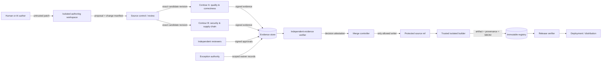
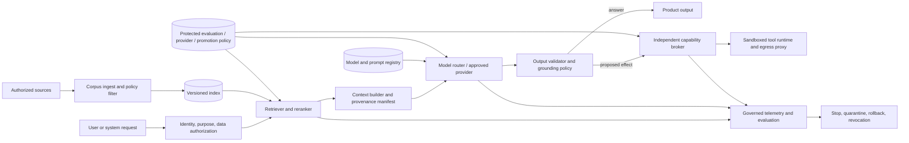
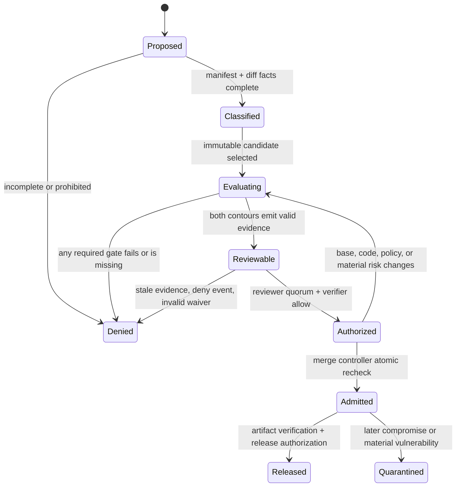

# MergeGrounds architecture

Status: normative architecture baseline

Audience: platform engineers, security engineers, repository owners, auditors

Scope: universal software admission for any language, framework, CI provider, and deploy target; conditional runtime assurance when the shipped product uses AI/ML

This document defines the target strict architecture. Committing the starter files does not establish conformance: external source-control rules, independent trust domains, identities, signing, evidence storage, and release enforcement must be implemented and verified in the deployment.

## 1. Assurance claim

MergeGrounds controls admission, not authorship. Code written by an AI, copied from a model, generated by a tool, or written by a human is untrusted until the same evidence-based admission process accepts it.

No finite test suite can prove arbitrary software safe. The system therefore makes a narrower, auditable claim:

> A protected revision is admitted only when the exact source tree and produced artifact satisfy the policy version selected for their risk tier; required independent reviewers approve the final diff; every required result is fresh, authentic, and bound to that revision; and no non-waivable condition is present.

The claim is invalid if a repository allows another path to update a protected ref, if gate configuration can be changed by the candidate revision that it evaluates, or if release artifacts can be rebuilt outside the attested build path.

For an AI-enabled product, the claim remains deliberately narrow: the exact identified model, prompt, retrieval/data, provider, tool, sandbox, and runtime configuration met the materialized product policy on the recorded evaluation scope. It is not a claim that a model is generally safe, correct, uncontaminated, or reliable outside that scope.

## 2. Security invariants

These invariants are stack-independent and non-negotiable:

1. **One admission path.** Only a dedicated merge identity may update protected refs. Direct pushes, force pushes, deletion, and administrator bypass are disabled.
2. **Exact subject binding.** Every result names the candidate commit/tree digest, base revision, policy digest, and—where relevant—the artifact digest. A result for another subject is unusable.
3. **Trusted policy.** Candidate code cannot replace, weaken, or select the policy used to judge itself.
4. **Two independent contours.** Correctness/quality and adversarial/security checks use separately controlled policy, identities, and execution contexts. A green result from one cannot substitute for the other.
5. **Fail closed.** Missing, stale, malformed, unverifiable, timed-out, skipped, or ambiguous evidence is a denial, never a pass.
6. **No self-approval.** The author, AI operator, service account that generated a change, and gate producer cannot satisfy an independent human approval requirement.
7. **Risk only escalates automatically.** The highest matching risk trigger wins. Reducing a machine-selected tier requires an explicit, reviewed classification decision; uncertainty selects the higher tier.
8. **Build once, promote by digest.** The reviewed revision is built in a trusted environment. The resulting immutable artifact is signed, scanned, and promoted without rebuilding.
9. **Exceptions are scoped debt.** A waiver applies to one rule, one subject/scope, for a short TTL and bounded uses. It never converts an unevaluated condition into a pass.
10. **Evidence is immutable.** Admission and release decisions remain independently verifiable after the CI job and source branch disappear.
11. **Claims are not evidence.** Model confidence, explanation, chain-of-thought, self-review, provider marketing, public benchmark scores, and dashboard labels have no admission authority. Evidence and decisions retain the distinct semantics defined in [`assurance-evidence.md`](assurance-evidence.md).

## 3. System context

The architecture separates **proposal**, **evaluation**, **admission**, and **release**. CI status labels are user interface hints; the signed decision attestation is the security control.

### Conditional AI-product context

The following dataflow is materialized only when the shipped product uses AI/ML. AI-assisted authorship alone does not create these product components.

The model and retrieved content are untrusted planners/inputs. Authorization occurs before data enters context and again before any tool effect. A capability broker, not the model, owns credentials and authorization. The protected registries and production decision path cannot be replaced by candidate configuration.

## 4. Trust boundaries

| Boundary | Untrusted side | Trusted side | Required crossing controls |
|---|---|---|---|
| B1 Authoring | developer workstation, model output, prompts, tools, copied snippets | change proposal | sandboxing; no production credentials; origin declaration; secret and binary checks; explicit diff |
| B2 Source admission | PR branch, fork, issue text, repository content | protected review state | immutable candidate revision; protected refs; verified identity; no direct write; risk classification |
| B3 Quality evaluation | candidate-controlled code and tests | contour A result | trusted runner definition; resource limits; clean checkout; deterministic toolchain; signed result |
| B4 Security evaluation | hostile source, dependencies, build scripts, test fixtures | contour B result | isolated runner; separate credentials/admins; restricted network; trusted policies/tools; signed result |
| B5 Decision | individual reports, approvals, exceptions | merge authorization | schema validation; subject/policy binding; quorum; freshness; deny precedence; independent verifier |
| B6 Build | admitted source plus external dependencies | releasable artifact | hermetic or declared inputs; pinned dependencies; ephemeral isolated builder; SBOM; provenance; signing |
| B7 Release | registry objects and metadata | deployed artifact | digest verification; signature/provenance verification; environment policy; promotion, not rebuild |
| B8 Governance | proposed policy/control changes | active control plane | separate PR; old-policy evaluation; security ownership; two-party approval; staged rollout; audit |
| B9 Retrieval/data | source documents, queries, embeddings, retrieved instructions | authorized model context | identity/purpose/data-class and tenant authorization before context; corpus/index provenance; freshness/deletion; injection handling; context manifest |
| B10 Model/provider | assembled context and mutable external service | identified model result | approved provider/model purpose; minimal authorized data; immutable revision or snapshot attestation; runtime-setting reconciliation; output validation |
| B11 AI evaluation/promotion | candidate model/configuration, public benchmarks, repository fixtures | release/promotion eligibility | protected expected-case and holdout registries; trusted evaluator; baseline/slice comparison; contamination analysis; exact subject binding |
| B12 Agent capability | untrusted model proposal and retrieved content | externally visible tool effect | independent user/service authorization; closed tool schema; narrow short-lived capability; effect-bound confirmation; audit |
| B13 Agent runtime/egress | hostile tool inputs and candidate actions | filesystem, network, external service | ephemeral sandbox; no ambient credentials; deny-by-default brokered egress; redirect/DNS/IP validation; data/purpose checks; resource limits |

Trust is not transitive merely because systems share a CI provider. Separate contours require distinct service identities, credentials, policy ownership, and runner pools or isolation domains. At minimum, no single repository PR or ordinary maintainer credential may modify both contours or fabricate their results.

## 5. Control-plane components

### 5.1 Change manifest and classifier

Before implementation admission, the protected base contains a reviewed design/decision record defining intended behavior, acceptance oracle, invariants, boundaries, failure behavior, and rollback at detail proportionate to risk. The proposal binds that record by digest and supplies a machine-readable manifest containing affected assets, generated-code disclosure, data classification, exposed interfaces, dependency changes, migration/rollback impact, and test evidence. A candidate cannot create or rewrite the design/oracle used to accept itself in the same decision. The classifier combines manifest declarations with diff-derived facts and rejects contradictions and under-classification.

Classification uses deterministic escalation triggers rather than an average score. The full model is defined in [`../skills/mergegrounds/references/control-model.md`](../skills/mergegrounds/references/control-model.md).

### 5.2 Policy bundle

The policy bundle is versioned, reviewed, signed, and referenced by digest. It defines:

- risk triggers and gate matrices;
- accepted evidence schemas and trusted producer identities;
- thresholds, freshness, and finding severity rules;
- required reviewer roles and separation-of-duty constraints;
- exception classes, budgets, and non-waivable controls;
- artifact and deployment rules.

The verifier obtains the active policy from a protected control-plane location or a trusted copy from the target branch. It never evaluates a candidate using policy code from that candidate.

### 5.3 Evaluation contours

**Contour A—quality and correctness** asks whether the implementation behaves as intended and remains maintainable. It owns build/compile checks, strict lint/type checks, unit and integration tests, contract tests, changed-code coverage, property tests, mutation tests, adapter-native changed-code maintainability deltas (complexity, duplication, dead code, suppressions, and refactor debt), deterministic/reproducible checks, and performance budgets.

**Contour B—security and supply chain** assumes the candidate may be hostile. It owns secret scanning, SAST, dependency and license policy, malware and binary inspection, IaC/container analysis, API/security tests, fuzzing, SBOM validation, provenance verification, workflow hardening, Unicode/confusable detection, and policy-tampering detection.

Both contours may run the same class of tool when defense in depth is valuable, but they must not consume one another's verdict as proof. Tier-driven checks are additive to the mandatory baseline.

### 5.4 Evidence store and verifier

Producers emit attestations into append-only storage. The verifier validates signatures, producer trust, schemas, subject and policy binding, freshness, quorum, and exception scope. It normalizes all states to `pass`, `fail`, `not_evaluated`, or `waived`; only `pass` satisfies a required non-waived gate.

The verifier emits a signed admission decision with a complete list of evidence digests. Merge controllers accept only a valid `allow` decision for the current protected-ref head and candidate revision. A base update, force-push, policy update, new material vulnerability, or substantive commit invalidates the decision.

### 5.5 Merge controller

The merge controller is a small, separately administered component with the only credential capable of updating a protected ref. It performs a final atomic check immediately before merge:

- candidate and base revisions still match the decision;
- required approvals remain valid and were made after the final substantive change;
- no new deny event or expired exception exists;
- the decision signature, policy digest, and evidence graph verify;
- queue ordering has not invalidated integration results.

If the source-control platform cannot enforce these properties, the repository does not meet this architecture's assurance claim.

### 5.6 Trusted builder and release verifier

Release builds run from an admitted revision in an ephemeral, isolated builder. Inputs are pinned by digest or captured as resolved dependencies. Network access is denied by default and enabled only to approved mirrors. The builder emits artifact digests, an SBOM, build provenance, test references, and a signature.

The release verifier evaluates the artifact—not merely the source PR—and issues a separate release decision. Deployment uses the verified artifact digest. Tags such as `latest` are never authorization inputs.

### 5.7 Conditional AI-product assurance plane

When AI/ML is shipped, the classifier materializes `MG-AI-001` through `MG-AI-008` as applicable under [`../skills/mergegrounds/references/ai-product-assurance.md`](../skills/mergegrounds/references/ai-product-assurance.md). The assurance plane adds:

- an immutable component manifest for model/provider revision, prompts, inference parameters, safety/output layers, retrieval pipeline and corpus, evaluation/training data, tools, sandbox, egress, and runtime policy;
- a trusted evaluation service that executes a protected expected-case manifest, verifies exact case/slice completeness, compares the production baseline, and emits typed evidence;
- private/time-split holdout and production-evaluation registries outside candidate and model-developer control;
- an externally governed provider-policy registry operated by data/privacy/legal/security authorities;
- a model-promotion controller that accepts only a valid release decision for the exact model and product configuration;
- governed runtime telemetry and a controller able to stop capability, revoke promotion, quarantine dependent evidence, and roll back by immutable identity.

Public benchmarks, repository-local declarations, provider claims, model self-review, confidence, and chain-of-thought remain claims or advisory inputs. They cannot replace evidence from those services. Repository state also cannot prove human independence, provider contract performance, or private-holdout secrecy.

## 6. Admission state machine

There is no `warning` state that permits merge. Warnings must be promoted to failure, explicitly accepted by a policy rule, or represented by a valid exception.

## 7. Execution isolation

Candidate code is hostile input. Evaluation runners therefore:

- start from clean, ephemeral images pinned by digest;
- receive no production, signing, repository-write, or control-plane credentials;
- use short-lived, least-privilege tokens bound to the job and subject;
- deny network by default; approved dependency access goes through authenticated, logged mirrors;
- cap CPU, memory, storage, wall time, process count, and output size;
- prevent access to host sockets, metadata services, sibling jobs, and cache write paths;
- treat caches as untrusted inputs and verify their keys/content before use;
- upload evidence through a narrow append-only channel;
- destroy the environment and ephemeral secrets after execution.

Signing happens outside the hostile execution context after the evidence collector validates outputs. Untrusted jobs cannot choose the attestation subject or producer identity.

An AI product's runtime agent is a separate boundary from its CI evaluator. It MUST execute tools through an independent capability broker, receive no ambient user/provider/control-plane credentials, and use an ephemeral sandbox plus deny-by-default egress proxy. Destination allowlisting alone is insufficient: the proxy also enforces resolved IP class, redirects, port/protocol/method, data classification, purpose, and payload/resource bounds. Sandbox and egress tests provide evidence for enumerated attack paths; they do not prove that an isolation platform or permitted destination has no covert channel or unknown vulnerability.

## 8. Protected control configuration

Changes to branch rules, CI workflows, policy bundles, code-owner maps, runner images, signing identities, evidence schemas, exception budgets, MergeGrounds scripts, AI applicability/gate thresholds, trusted evaluators, holdout or provider registries, model-promotion authority, capability broker, or sandbox/egress policy are risk tier R4.

Such a change:

1. is isolated from product behavior changes;
2. is evaluated using the last trusted version of the control plane;
3. includes negative tests showing prohibited changes remain blocked;
4. receives platform-owner and security-owner approval from different people;
5. is signed and rolled out through staging before becoming active;
6. cannot approve itself or retroactively validate an earlier candidate.

Recovery keys and administrator identities use strong phishing-resistant authentication, just-in-time elevation, two-person activation where supported, and immutable audit logging.

## 9. Failure and degradation behavior

- **Tool unavailable or timed out:** deny; retry on a clean runner. Availability does not lower assurance.
- **Vulnerability intelligence unavailable/stale:** deny dependency-affecting and release operations; cached intelligence may be used only within its policy freshness window.
- **Evidence/signature store unavailable:** deny admission and release; do not trust local CI state alone.
- **Classifier disagreement:** select the higher tier and open a classification review.
- **Conflicting results:** deny. A later pass does not erase a previous unexplained fail; the evidence graph must identify a code/tool/policy change or an adjudicated false positive.
- **Compromised producer:** revoke trust, quarantine decisions depending on it, reconstruct affected subjects, and rerun on a trusted producer.
- **New critical post-merge finding:** mark the revision and derived artifacts quarantined, stop promotion, invoke incident response, and issue a signed revocation/advisory record.
- **Unknown or changed model/provider/configuration identity:** stop affected promotion or capability; local aliases and dashboards cannot restore identity; obtain fresh external identity/evaluation evidence.
- **AI evaluation incomplete or contaminated:** deny promotion; preserve failed/invalid case accounting; replace or independently assess the affected holdout before rerun.
- **Provider authorization absent, stale, or mismatched:** stop sending affected data. Repository configuration cannot waive or prove external contractual/data-governance facts.
- **Agent sandbox, authorization, or egress violation:** revoke capabilities, destroy the sandbox, retain redacted audit evidence, assess affected data/effects, and quarantine dependent decisions.
- **Material runtime drift or critical slice violation:** invoke the bound stop condition, roll back or fail safely, quarantine affected promotion evidence, and re-evaluate before resuming.

Emergency handling is defined in [`../skills/mergegrounds/references/exceptions.md`](../skills/mergegrounds/references/exceptions.md). Break-glass never silently changes a failing result to green.

## 10. Deployment profiles

The controls are outcome-based; products may substitute tools if evidence semantics remain equivalent.

- **Local/pre-commit:** fast feedback only. Results are advisory because the workstation is untrusted.
- **Pull request:** complete admission baseline, tier-conditional tests, and independent reviews on an immutable candidate.
- **Merge queue:** reruns integration-sensitive gates against the exact prospective protected-ref state.
- **Nightly/deep:** long fuzzing, broad SAST, full dependency inventory, mutation tests, and drift checks; for AI products, broad retrieval/context/tuning regression and contamination checks. Findings can revoke release eligibility but cannot retroactively legitimize a weak PR path.
- **Release:** clean trusted build, artifact scan, SBOM, provenance, signing, and digest-bound authorization.
- **Continuous monitoring:** dependency advisories, credential exposure, policy drift, provenance verification, and anomaly detection across admitted revisions and released artifacts; for AI products, governed production evaluation, component/input drift, corpus freshness, provider-policy reconciliation, tool/egress violations, latency/cost limits, and model-promotion revocation.

## 11. Adoption without weakening the target state

Existing repositories may have debt. Adoption uses a declared migration state:

1. Inventory protected refs, release paths, identities, policies, dependencies, and existing findings.
2. Close alternate write/release paths before claiming enforcement.
3. Establish an immutable baseline of existing debt; all new or changed code must meet the target policy and total debt may never increase.
4. Give each baseline finding an owner and remediation deadline. Baselines are not waivers and cannot hide new instances.
5. Move control families from observe to enforce on a published schedule approved by security ownership.
6. Remove the migration state by its fixed expiry. Extension is a governance decision and consumes exception budget.

Greenfield repositories start fully enforced; they do not receive a baseline allowance.

## 12. Standards alignment

The architecture borrows outcome language and evidence patterns from these primary specifications without claiming automatic compliance:

- [NIST SP 800-218, Secure Software Development Framework 1.1](https://doi.org/10.6028/NIST.SP.800-218)
- [NIST SP 800-218A, SSDF Community Profile for Generative AI and Dual-Use Foundation Models](https://csrc.nist.gov/pubs/sp/800/218/a/final)
- [SLSA specification 1.2](https://slsa.dev/spec/v1.2/)
- [SLSA Source requirements](https://slsa.dev/spec/v1.2/source-requirements)
- [in-toto Attestation Framework](https://github.com/in-toto/attestation)
- [OWASP Application Security Verification Standard 5.0.0](https://owasp.org/www-project-application-security-verification-standard/)
- [SPDX specification](https://spdx.dev/specifications/)
- [CycloneDX specification](https://cyclonedx.org/specification/overview/)

Compliance mappings are implementation-specific: tool presence alone does not satisfy a control unless its result is enforced, authentic, complete for the subject, and retained as evidence.
